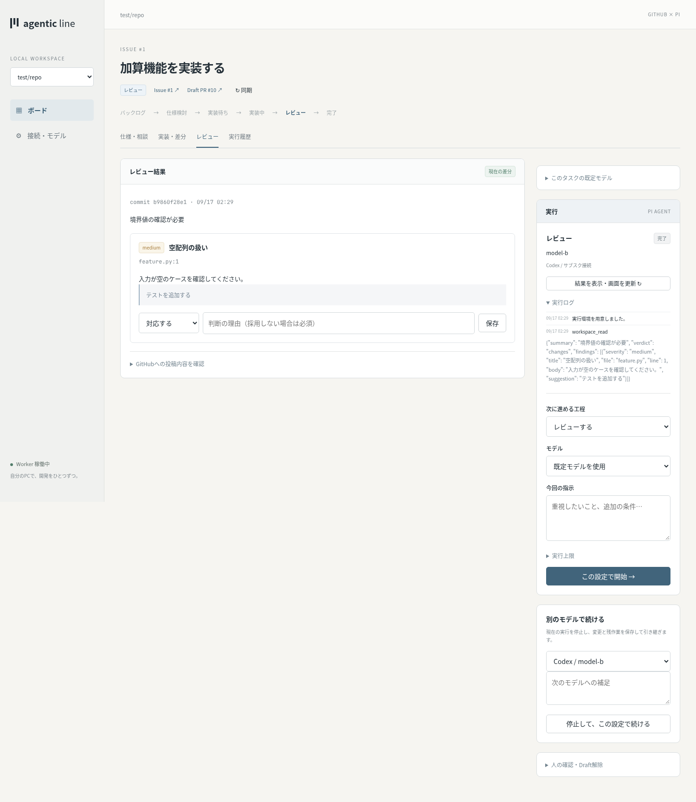

# agentic-line

GitHubのIssueから仕様を決め、Piで実装・レビューを進める、個人用のローカル看板アプリです。FastAPI / Jinja2 / HTMX / SQLiteで動作します。



## 起動

必要なもの: Python 3.12以降、[uv](https://docs.astral.sh/uv/)、Git、Node.js、Docker、Pi。Linuxで検証しています。Dockerデーモンを起動し、現在のユーザーで`docker run`できる状態にしてください。

```bash
uv sync --locked
npm install --global @earendil-works/pi-coding-agent@0.85.1
docker pull python:3.13-slim
pi
```

Piで`/login`から **OpenAI Codex** を選び、ChatGPTでログインします。既にログイン済みなら再設定は不要です。Piを終了して、アプリを起動します。

```bash
uv run kanban serve
```

表示されたURLをブラウザで開きます。既定ポートは`8765`です。URLを再表示する場合は`uv run kanban url`、ポートを変える場合は`uv run kanban serve --port 8766`を使います。Ctrl+CでWebとWorkerを終了します。

## 最初の設定

1. 「接続・モデル」でGitHubのPersonal access tokenを保存します。
2. `owner/repository`を登録します。登録すると既存Issueを取り込みます。
3. 「利用できるモデルを取得」を押し、仕様相談・実装・レビューの既定モデルを選びます。
4. リポジトリごとにコンテナイメージとテストコマンドを設定します。

GitHubのfine-grained PATには、対象リポジトリの **Issues / Pull requests / Contents: Read and write** が必要です。Checksの読み取りは任意です。GitHub側のポリシーやブランチ保護により操作が拒否された場合は画面に理由を表示します。[Issue権限](https://docs.github.com/en/rest/issues/issues#create-an-issue)、[PR権限](https://docs.github.com/en/rest/pulls/pulls#create-a-pull-request)、[Contents権限](https://docs.github.com/en/rest/repos/contents#create-or-update-file-contents)

アプリのリポジトリに設定する`git remote`と、アプリが操作するGitHubへの接続設定は別です。アプリ内のGit操作はPATを使い、管理用cloneとタスク用worktreeを作成します。既存の作業ディレクトリを直接編集しません。

## 開発の流れ

1. ボードからIssueを起票するか、GitHubの既存Issueを取り込みます。
2. 仕様をPiと相談し、Markdownを編集して確定します。確定版をIssue本文の管理領域に反映します。
3. 実装を開始すると専用ブランチとDraft PRを作成し、Piがコードを変更します。アプリがテスト・commit・push・PR本文の更新を行います。
4. レビューは独立したセッションで、仕様版・比較元SHA・実装SHAを固定して実行します。
5. 指摘を「対応する・採用しない・保留」に分け、対応する指摘を修正します。レビューのGitHub投稿とDraft解除は画面の操作で行います。
6. GitHubでマージすると同期後に「完了」へ移動します。未マージのcloseは「中止・要確認」と表示します。

モデル設定の優先順は **今回の指定 → タスク → リポジトリ → アプリ** です。設定はRun開始時に保存されます。「別のモデルで続ける」は実行を止め、作業ファイルとセッションを保持して新しいRunを作ります。工程内の再開でモデル未指定の場合は前の設定を引き継ぎます。レビューは再開時にも独立したセッションを作ります。

GitHubはWorkerが空いた際に約60秒間隔で同期します。「同期」ボタンでも更新できます。長い実行の間、GitHub同期ジョブは待機します。

## 実行環境

Piが使うファイル操作・shellツールはDockerコンテナで実行します。ネットワーク接続なし、CPU・メモリ・プロセス数制限あり。GitHubトークン、Piの認証ファイル、ホストのホーム、Dockerソケットはコンテナに渡しません。Pi自体はホスト上でProviderへ接続します。

既定イメージはPython標準ライブラリのみです。依存パッケージやNode.js等が必要なら、**Python 3も含む開発用イメージを先に作成**し、リポジトリの設定で指定してください。セットアップコマンドもネットワークのないコンテナで実行します。例えばPythonプロジェクトでは依存をイメージに組み込み、テストコマンドを`python3 -m pytest -q`にします。

コードやテストには通常のDockerプロセス分離を使います。個人PC向けであり、複数ユーザー向けの実行基盤ではありません。

## OpenRouter / ローカルLLM

Providerの接続情報はPiが管理します。既存のPi設定を使用します。

- **OpenRouter**: Piの`/login openrouter`でAPIキーを登録します。`OPENROUTER_API_KEY`環境変数にも対応します。
- **llama.cpp router**: Piの`/login llama.cpp`で接続先を設定し、`/llama`でモデルをロードします。`LLAMA_BASE_URL`と`LLAMA_API_KEY`も使用できます。
- **その他のOpenAI互換ローカルサーバー**: Piの`~/.pi/agent/models.json`に登録します。例は[設定例](docs/local-model.example.json)を参照し、サーバーのモデルIDとURLに置き換えてください。既存ファイルがある場合は`providers`へ追加します。

その後、アプリでモデル一覧を再取得します。ツール呼び出しに対応したモデルとサーバー設定が必要です。初期版の実推論検証はCodexで行っています。OpenRouter・llama.cppへの切り替え経路は模擬Providerで検証しており、それぞれの実推論は未検証です。

Codexは`openai-codex`のOAuth認証を要求し、制限・認証エラー時に別ProviderやAPI課金へ自動で切り替えません。残り利用枠と請求額を推測して表示しません。履歴の使用量はPiが返したセッション統計であり、再開時は前のRun分を含む場合があります。

## 保存先・復旧

既定の保存先は`~/.local/share/kanban`です。

| 保存物 | 場所 |
| --- | --- |
| 状態・ジョブ・ログ | `kanban.sqlite3` |
| GitHub PAT / ローカルログイン | `secrets/`（ファイル権限600） |
| 管理clone / タスクの変更 | `repos/` / `workspaces/` |
| Piセッション | `sessions/` |
| チェックポイント | `artifacts/<run-id>/` |

停止・異常終了後も作業ファイルを残します。Worker再起動時は以前のRunを「中断・再開可能」にし、タスク画面から続行します。GitHub操作の応答を失った場合は、操作IDでGitHub側の結果を照合し、見つからない間は自動再投稿しません。エラー表示の「結果を再確認」を使います。

チェックポイントは変更差分・HEAD・作業ファイルのアーカイブです。作業フォルダを手動で削除した場合の自動復元は行いません。バックアップはアプリを止めて保存先全体をコピーしてください。ログ・セッション・アーカイブの自動削除は初期版にはありません。

| 環境変数 | 用途 |
| --- | --- |
| `KANBAN_DATA_DIR` | アプリの保存先 |
| `KANBAN_PORT` | ポート（既定8765） |
| `KANBAN_PI_BIN` | Pi実行ファイル（既定`pi`） |
| `KANBAN_PI_AGENT_DIR` | Piの設定・認証ディレクトリ（既定`~/.pi/agent`） |
| `KANBAN_SANDBOX_IMAGE` | 新規登録リポジトリの既定イメージ |

WebとWorkerを分けて起動する場合は、同じ環境変数で`uv run kanban web`と`uv run kanban worker`を実行します。同じ保存先でWorkerを二重起動すると拒否します。

## 検証

```bash
uv run ruff check kanban tests
uv run pytest -q

# 実ブラウザ（GitHubと推論は模擬実装）
uv run playwright install chromium
KANBAN_BROWSER_TEST=1 uv run pytest tests/test_browser.py -q

# 任意: 実際のCodex利用枠を使用する。GitHubは模擬実装。
KANBAN_LIVE_PI_TEST=1 uv run pytest tests/test_live_pi.py -q
```

実推論テストのモデルは`KANBAN_LIVE_MODEL`で変更できます。既定は今回検証した`gpt-5.6-luna`です。実際にアカウントで使えるモデルを指定してください。

[設計書](docs/design.md) / [画面設計](docs/screen-design.md) / [検証結果・制約](docs/implementation.md)
