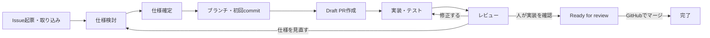
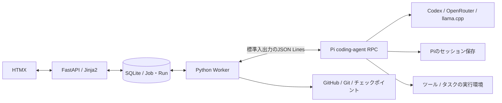
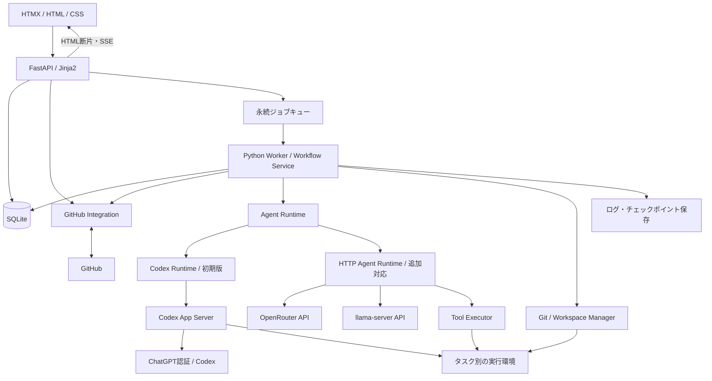
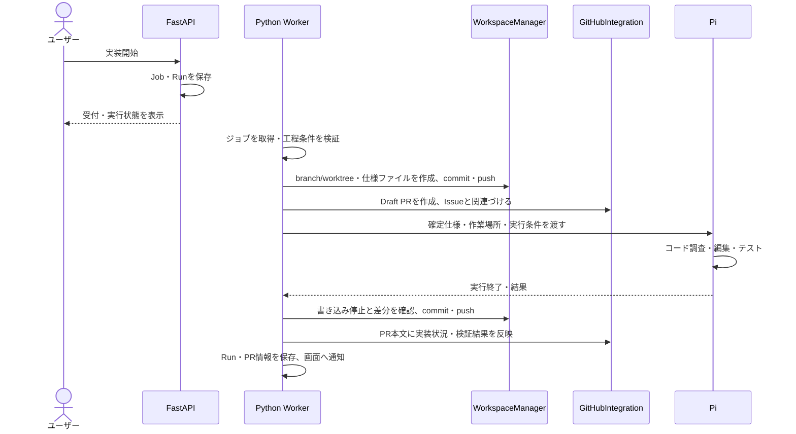

# GitHub連携カンバンアプリ 設計書

- バージョン: 0.8
- 作成日: 2026-09-17
- ステータス: 初期設計案
- 仮称: Kanban

## 1. 目的

GitHubのIssueを起点に、仕様決め、Draft PRでの実装、レビュー、修正を一つのカンバン画面で進められるアプリを作る。

まずCodexで仕様・実装・レビューを一巡できるようにし、ChatGPTのサブスクリプションで利用することを優先する。続いてOpenRouterとローカルのllama.cppを接続先に追加し、工程別のモデル選択や実装途中の引き継ぎを可能にする。

アプリが担う中心的な役割は、開発の進行管理、LLMの実行、作業コンテキストの保存、GitHubとの同期である。

## 2. 要件と初期の前提

### 2.1 ユーザー要件

| 要件 | 目指す操作 |
| --- | --- |
| 自分のPCで個人利用する | ローカルで起動したWebアプリをブラウザから操作する |
| カンバンで開発を管理する | Issueごとの仕様・実装・レビューの進捗を一覧する |
| GitHub連携を前提にする | アプリからIssueを起票し、既存Issueも取り込む |
| Issueで仕様を決める | LLMとの相談結果をIssueの仕様と受け入れ条件にまとめる |
| Draft PRで実装する | 作業ブランチとDraft PRを用意し、実装を追加する |
| レビューできる | LLMで差分をレビューし、指摘に対する修正と再レビューを行う |
| Provider・モデルを柔軟に切り替える | 工程別の設定と、個々の実行時の変更を可能にする |
| 初期の実行先はCodex | 仕様・実装・レビューをCodexで進め、ChatGPTログインによるサブスク利用を優先する |
| 追加の接続先はOpenRouterとllama.cpp | 両者はHTTP APIへ直接接続し、モデルを切り替える |

### 2.2 確定した利用形態とLLM接続方式

自分のPCで動かす、個人用のWebアプリとする。初期版はこの利用形態を対象に設計・実装する。

- 利用者は本人1人とし、同じPCのブラウザから操作する。
- アプリのAPI、Worker、DB、作業ファイルは自分のPCに配置する。
- 初期版はCodexのみで利用できるようにし、ChatGPTのサブスク認証を優先する。組み込み方法はPi coding-agentのRPC方式を推奨し、公式App Server方式との比較・接続検証で決める。
- OpenRouterとローカルのllama.cppは、その後に追加するHTTP API接続先とする。「localのllama」はllama.cppの`llama-server`を想定し、モデルは別途選択する。
- 工程・実行履歴・成果物はアプリが管理する。内部の実行ループをCodexに任せるか、pi系ライブラリで共通化するかは実装方式の選定事項とする。

### 2.3 この設計書で置く仮の前提

以下は確定要件ではなく、初期実装を具体化するための提案である。

| 項目 | 初期案 | 理由 |
| --- | --- | --- |
| Webアプリの技術 | FastAPI + Jinja2 + HTMX | Pythonで状態とHTMLを管理し、画面の必要な部分を更新する。ユーザーの「htmlx」はHTMXとして検討する |
| リポジトリ | 複数登録可能。ボードはリポジトリごと | Issue番号や設定の所属を明確にする |
| タスクの単位 | 1 Issueにつき1カード、同時に有効な実装PRは1つ | 実装・レビューの対象を追いやすくする |
| 自動化 | ユーザーが工程を開始すると、設定した範囲内で実行する | 操作を繰り返さず進めながら、工程ごとの判断を残す |
| マージ | 初期版はGitHub上で人が行い、結果を同期する | まず仕様・実装・レビューの一巡を完成させる |

GitHub Projectsとの同期は初期版に含めず、ボードの列や並び順はアプリが管理する。

## 3. 基本方針

1. **公開した仕様とコードの正本はGitHubに置く。** Issue、PR、commit、GitHub上のレビューを参照できる状態にする。
2. **実行の記録はアプリが持つ。** 使用モデル、指示、ツール実行、テスト結果、途中経過、再開に必要な情報を保存する。
3. **工程、実行状態、GitHubの状態を分ける。** APIエラーで実装が止まっても、カードの工程は「実装中」のまま「失敗」を表示できるようにする。
4. **モデルを変えても、同じ仕様とコードから続行する。** Provider固有の会話IDを作業の唯一の保存先にしない。
5. **LLMの出力と、完了を裏付ける事実を分ける。** 「テスト成功」「PR作成済み」「マージ済み」は、ツールやGitHubの結果で判定する。

## 4. 開発フロー



### 4.1 Issueの起票と仕様決め

1. リポジトリを選び、やりたいことを入力する。
2. Issueのタイトルと本文を作成・編集し、起票する。既存Issueの選択も可能にする。
3. 仕様用のProvider・モデルを選び、Issue詳細画面で相談する。
4. LLMは不足情報、仕様案、受け入れ条件を提示する。人は追記・修正できる。
5. 「仕様を確定」でGitHubへの反映を行い、反映済みの仕様を改訂番号付きで保存する。

仕様の基本構成は次のとおりとする。

- 背景・解決したい問題
- 実現する振る舞い
- 対象範囲・対象外
- 受け入れ条件（AC-1、AC-2のようなID付き）
- 技術上の制約
- 未決事項
- 検証方法

相談の全メッセージはアプリに保存し、GitHubにはユーザーが反映した仕様と必要な決定事項を残す。実装を妨げる未決事項があれば、仕様確定時に扱いを決める。

### 4.2 Draft PRの準備と実装

「実装開始」は、確定した仕様に基づくブランチ作成、初回commit、push、Draft PR作成、実装、設定済みテストの実行をまとめて開始する操作とする。画面には対象リポジトリ、ブランチ、モデル、実行範囲を表示する。

1. Workerが対象リポジトリをfetchし、base branchとbase SHAを記録する。
2. タスク専用ブランチと作業ディレクトリを作る。
3. 確定仕様と実装計画を、設定したパス（初期案: `docs/tasks/issue-<number>.md`）へ保存してcommit・pushする。
4. この変更を使ってDraft PRを作成し、IssueへのリンクをPR本文に記載する。
5. LLMがコードの調査、編集、テストを繰り返す。
6. 作業区切りで変更をcommit・pushし、PR本文の実装状況と検証結果を更新する。
7. 実装結果を表示し、レビューへ進む。

GitHubの標準的なPR作成フローは、ブランチへ変更をcommit・pushしてからPRを開く順序になっている。この設計では、仕様・計画の実ファイルを初回の差分に使い、実装の早期からDraft PRを持てるようにする。[GitHub: Pull request quickstart](https://docs.github.com/en/pull-requests/get-started/pull-request-quickstart)

仕様ファイルをリポジトリに置かない設定では、最初の実装差分をpushした時点でDraft PRを作る。作成前はカードに「PR準備中」と表示する。Draft PRの作成にはAPIの`draft`指定を使う。[GitHub: Create a pull request](https://docs.github.com/en/rest/pulls/pulls#create-a-pull-request)

### 4.3 レビューと修正

1. 実装とは独立してレビュー用Provider・モデルを選択する。同じモデルも利用できる。
2. 対象の仕様改訂、PR head SHA、base SHA、比較に使うmerge-baseを固定する。
3. 仕様、差分、関連コード、テスト結果をレビューへ渡す。
4. 指摘と受け入れ条件ごとの判定をアプリに保存する。
5. ユーザーは指摘を「対応する」「採用しない」「保留」に分類できる。採用しない場合は理由を残せる。
6. 「修正開始」で選択した指摘を実装用モデルに渡す。この時点でモデルを変更できる。
7. 修正を同じPRへ追加し、再レビューする。

レビュー結果は、重大度、対象ファイル・行、問題の発生条件、根拠、修正案を持つ。コードを十分に確認できなかった場合は「問題なし」ではなく「判定できない」とする。

GitHubへ共有する際は、初期版ではユーザーが「レビューを投稿」を選び、LLMの結果と明記した`COMMENT`形式で投稿する。アプリ上の評価は人の承認やGitHubの必須レビューを代替しない。GitHubのReview APIには対象commitを指定できるため、実際に読んだSHAを指定する。[GitHub: Create a review](https://docs.github.com/en/rest/pulls/reviews#create-a-review-for-a-pull-request)

レビュー中・投稿前にheadや比較対象が変わった場合、結果を「旧版に対するレビュー」として保持する。現在の差分への評価には使わず、新しいスナップショットで再レビューする。初期版のGitHub投稿は全体コメントを中心にし、行単位コメントは位置を正しく対応付けられる場合に拡張する。

### 4.4 完了

- ユーザーが内容を確認し、Draft解除を指示できる。
- 初期版のマージ操作はGitHub上で行う。
- アプリがPRの`merged`状態を取得したら、カードを「完了」にする。
- PRが未マージでcloseされた場合や、Issueだけがcloseされた場合は「中止・要確認」として扱い、完了と区別する。
- 再openされたIssueや代替PRへの付け替えでは、過去のPR・実行履歴を残す。

## 5. カンバンと画面

画面の配置と操作イメージは[画面設計](screen-design.md)を参照。[ワイヤーフレームHTML](wireframes/index.html)でボード、仕様、実装、レビュー、接続設定を切り替えて確認できる。

### 5.1 ボードの列

| 列 | 意味 | 次へ進む条件 |
| --- | --- | --- |
| バックログ | 起票・取り込み済み | 仕様検討を開始する |
| 仕様検討 | 要件や受け入れ条件を整理中 | 仕様をGitHubへ反映し、改訂を確定する |
| 実装待ち | 実装可能な仕様がある | 実装を開始する |
| 実装中 | PR準備、実装、テスト、指摘修正 | 変更をpushし、検証結果を記録してレビューを開始する |
| レビュー | LLMレビュー、人の確認、マージ待ち | PRのマージを同期する |
| 完了 | 対象PRがマージ済み | 履歴を参照する |

「待機中」「実行中」「入力待ち」「停止中」「失敗」「同期競合」「旧版レビュー」はカードのバッジで表す。「中止」は別フィルターで表示する。

列の移動は工程の操作に結び付ける。たとえば「実装待ち→実装中」では実行設定を表示する。「完了」へのドラッグだけでGitHubのマージ済み状態を作らない。

### 5.2 必要な画面

| 画面 | 主な内容 |
| --- | --- |
| リポジトリ一覧 | 接続先、同期状態、ローカル作業場所、追加・選択 |
| カンバン | Issue、PR、工程、実行状態、使用モデル、最終更新 |
| タスク詳細 | 仕様、相談、PR差分、レビュー、実行履歴をタブ表示 |
| 実行パネル | Provider・モデル、指示、開始・停止・別モデルで続行、ログ |
| 設定 | 接続情報、工程別モデル、テストコマンド、実行上限、GitHub反映設定 |

モデル選択は「実行先 → 接続先 → モデル」の順で行う。初期版の実行先はCodexとし、OpenRouterとllama.cppは追加予定として表示する。CodexではChatGPTログイン状態、HTTP接続ではAPI接続状態を表示する。モデル名は接続先から取得し、同じモデルでも工程別の指示を使い分ける。

## 6. Provider・モデル・実行方式

第6.1〜6.6節はApp Server方式の比較用の具体案とする。サブスク利用にApp Serverが必須という意味ではない。pi/ompの方式を第6.7節で比較し、セッション管理の自作を抑えるための推奨案を第6.8節に記す。組み込み方式の最終決定は接続先の確定事項とは分けて扱う。

### 6.1 概念を分ける

| 概念 | 責務・例 |
| --- | --- |
| ProviderConnection | 実行先、Runtime種別、認証方式、認証情報への参照、必要な場合のURL。Codex・OpenRouter・llama.cppを表す |
| ModelProfile | モデルID、対応能力、出力上限、Provider固有パラメータ |
| AgentProfile | 仕様・実装・レビューの役割、指示、利用ツール、実行上限 |
| AgentRuntime | 実行の開始、イベント取得、入力待ち、停止・再開、成果物収集の共通インターフェース |
| Run | 実行時点の設定、入力、成果物、結果を固定した1回の実行 |

Codexでは、公式App Serverを使って認証、会話、実行イベントをアプリへ組み込む。WorkerはローカルのCodexプロセスとstdioで通信し、UIへ必要な情報を中継する。App Serverは自作製品への組み込み用インターフェースとして案内されている。[OpenAI: Codex App Server](https://learn.chatgpt.com/docs/app-server)

OpenRouter・llama.cppでは、アプリ側が「モデル呼び出し→ツール実行→結果返却」のループを持つ。Codexと共通化するのはRun、成果物、工程操作であり、内部のツール実装や会話形式が同じとは仮定しない。

### 6.2 Adapterの境界

```text
Workflow Service
  └─ AgentRuntime
       ├─ Codex Runtime（初期版）
       │    └─ Codex App Server / ChatGPTログイン
       └─ HTTP Agent Runtime（追加対応）
            ├─ OpenRouter Adapter
            ├─ llama.cpp Adapter
            └─ Tool Executor（参照・編集・コマンド実行）
```

Runtimeごとに入力とイベントを共通形式へ変換する。Codexのthread・turn IDなどの継続情報は同じ実行先での再開に利用し、他の実行先への移行ではアプリ管理のチェックポイントを使う。HTTP側はAPI形式の差をProvider Adapterに閉じ込める。

| 共通操作 | 役割 |
| --- | --- |
| 接続確認・モデル登録 | Codexのログイン、HTTPの到達性・認証、使用できるモデルを確認する |
| 能力検証 | 実行範囲の制限、停止・再開、イベント取得と、HTTP側のTool calling等を確認する |
| 実行開始・続行 | 仕様、作業場所、モデル、工程の指示、実行条件を渡す |
| イベント変換 | テキスト、実行操作、入力・許可待ち、使用量、終了、エラーを共通形式へ変換する |
| 中断・成果物収集 | Runtimeの停止を確認し、変更と再開情報を保存する |

| 実行先 | 接続方法 | 認証・利用枠 | 対応順 |
| --- | --- | --- | --- |
| Codex | ローカルの公式App Server | ChatGPTログインによるサブスク利用を優先 | 最初のMVP |
| OpenRouter | HTTP API | OpenRouter API key・同サービス側の利用枠 | MVPの次 |
| llama.cpp | 稼働中の`llama-server`のHTTP API | ローカルサーバー設定に従う | OpenRouterと同じ追加段階 |

HTTP接続は「OpenAI互換」という名称だけで同じ機能が使えるとは判定しない。Tool calling、JSON形式、パラメータの対応を接続先・モデルごとに検証する。必要能力を満たさないモデルは該当工程で選択不可とし、理由を表示する。

### 6.3 設定の優先順位

1. 今回の実行で指定した設定
2. タスクの工程別設定
3. リポジトリの工程別設定
4. アプリ全体の既定値

実行開始時に解決した設定をRunへ保存する。設定画面で既定値を変えても、進行中のRunには反映しない。モデルIDをコードへ固定せず、Providerが返した実モデル情報があれば併記する。

### 6.4 作業途中の切り替え

切り替えは「同じタスクを別設定の新しいRunで続ける」操作とする。

1. 現在のRunへ停止を要求し、新しいツール実行を止める。
2. 実行中の処理を終了または中断し、ファイルへの書き込みが止まったことを確認する。
3. commit済み・未commitの差分、未追跡ファイル、テスト結果、残作業をチェックポイントとして保存する。
4. 次のProvider・モデルの能力とコンテキスト容量を検証する。
5. 引き継ぎ情報から新しいRunを作り、前Runを`parent_run_id`で参照する。

Codex内のモデル変更もRunの区切りで行い、開始時に確定した設定を保存する。レビューには実装とは別のCodex threadを用意し、固定した仕様・差分を渡す。OpenRouter・llama.cppへの切り替えでも、Codexのthreadそのものを移植せず同じ成果物から続行する。

モデル固有の内部状態や非公開の思考過程の移植は前提にしない。以下のアプリ管理データから作業を再構成する。

- 確定仕様と改訂番号、追加されたユーザー指示
- リポジトリ、ブランチ、base/head SHA
- 変更済みファイルと差分、チェックポイントの識別子
- 実行したコマンド、終了コード、テスト結果
- レビュー指摘と対応状況
- 決定事項、残作業、未決事項の要約
- 実行条件、ツール権限、残りの上限

要約から元のメッセージや成果物を辿れるようにし、受け入れ条件は要約で落とさない。容量不足なら関連ファイルを検索・分割して渡し、それでも不足する場合は入力待ちにする。

障害時は同一接続への上限付きリトライを行えるが、別Providerへの自動切り替えは初期値で無効にする。将来有効にする場合も、許可した接続先と予算内に限定し、切り替えを別Runとして記録する。

### 6.5 Codexのログインと利用枠

CodexはChatGPTログインによるサブスクリプション利用と、API keyによる従量利用に対応する。本アプリは前者を初期の接続方法にする。一般のOpenAI APIやOpenRouterへの呼び出しに、ChatGPTのサブスク枠を適用する設計にはしない。[OpenAI: Authentication](https://learn.chatgpt.com/docs/auth)

設定画面では「ChatGPTでログイン」を入口にし、Codex側の認証フローへ進む。パスワードやOAuthトークンを本アプリのフォームに入力させず、認証情報の保存・更新はCodexに任せる。既存のログインを使う場合も認証方式を確認し、API key方式をサブスク接続として表示しない。

App Serverのアカウント確認・ログイン、モデル一覧、利用制限取得を使う。画面には確認できたログイン方式と利用状態を表示し、モデルIDや制限値を固定しない。[OpenAI: App Server account APIs](https://learn.chatgpt.com/docs/app-server)

利用可能な枠は契約・アカウント状態に依存する。制限に達したら作業を保存し、再開可能時刻が分かれば表示する。OpenRouterへの切り替えはユーザーが選択する操作とし、課金方式を黙って切り替えない。

初期導入で使うCodexのバージョンを固定し、その版のプロトコルで連携を検証する。調査環境では`codex-cli 0.154.0`のApp Serverコマンドが存在することを確認済みだが、ログインや実推論の検証は未実施。App Serverは実験的な機能として案内されているため、バージョン更新時に互換性を確認する。[OpenAI: App Server protocol](https://learn.chatgpt.com/docs/app-server#protocol)

### 6.6 OpenRouterとローカルllama.cpp

OpenRouterはAPI keyとモデルIDを登録してHTTP接続する。モデル一覧を取得して選択肢を作り、実行に利用したモデル情報を保存する。[OpenRouter: Quickstart](https://openrouter.ai/docs/quickstart)

ローカルはllama.cppの`llama-server`へ接続する。同サーバーにはOpenAI互換のChat Completionsとツール呼び出しの仕組みがあるが、モデルとテンプレートの組み合わせを確認する。[llama.cpp: server documentation](https://github.com/ggml-org/llama.cpp/blob/master/tools/server/README.md)

- 接続設定は表示名、API方式、base URL、モデルID、必要な場合の認証情報を持つ。
- モデルのロード、推論サーバーの起動・停止は初期版ではユーザーが行う。アプリは稼働中のAPIへ接続する。
- 接続確認はAgentRuntimeが動くWorkerから行い、ブラウザからLLM APIを直接呼ばない。
- コンテキスト上限や使用量を取得できない場合は、手動設定や「未計測」の表示で扱う。
- 実装・レビューに必要なツール呼び出しをモデルとサーバーの組み合わせで検証する。モデル名だけで対応を決めない。
- 接続断やモデルのロード待ちでは、タスクの成果物を保持し、再接続または別の接続先で続行できるようにする。

### 6.7 pi / ompとの比較

pi（pi coding agent）とomp（oh-my-pi）は、モデル接続と認証をAPIライブラリで抽象化し、エージェント処理とツール実行を自前の層で管理している。両者のAPIライブラリにはCodexのOAuth接続と複数Providerの対応がある。[pi: API library](https://github.com/earendil-works/pi/blob/main/packages/ai/README.md)・[omp: API library](https://github.com/can1357/oh-my-pi/blob/main/packages/ai/README.md)

Codex向けの通信実装はそれぞれのライブラリ内にあり、Codex App Serverへエージェント処理を依頼する構成とは異なる。[pi: Codex transport](https://github.com/earendil-works/pi/blob/main/packages/ai/src/api/openai-codex-responses.ts)・[omp: Codex transport](https://github.com/can1357/oh-my-pi/blob/main/packages/ai/src/providers/openai-codex-responses.ts)

| 比較項目 | App Server方式（本文の具体案） | pi系ライブラリを再利用する方式 |
| --- | --- | --- |
| Codexでの実行 | Codex本体の処理をアプリから操作する | Codex用モデル接続を共通エージェントから使う |
| ツール・実行ループ | Codex用とHTTP用で実装が分かれる | Codex・OpenRouter・llama.cppで共通化できる |
| 認証 | Codexの公式ログイン管理を使う | ライブラリのOAuth処理とアプリ側の認証情報管理を使う |
| 変更への追随 | Codex本体とApp Serverのバージョンに追随する | 採用するライブラリと各接続先の変更に追随する |
| 本アプリとの相性 | Codex本体の機能を使って先に一巡させやすい | 複数の実行先で同じツールと履歴を扱いやすい |

低い層のライブラリを組み合わせる案では、`pi-ai`にモデル接続・認証処理、Piの`pi-agent-core`に実行ループを担当させる。アプリはGitHub連携、工程、workspace、実行条件、チェックポイントを管理する。piとompはいずれもツール実行とイベント通知を持つエージェント層を公開している。[pi: Agent library](https://github.com/earendil-works/pi/blob/main/packages/agent/README.md)・[omp: Agent library](https://github.com/can1357/oh-my-pi/blob/main/packages/agent/README.md)

設計判断として、複数の接続先で同じ実装・レビュー処理を使うことを優先するなら、pi系ライブラリの再利用は有力な案である。ただし、ライブラリにCodex用OAuth実装があることと、任意の第三者アプリへのOpenAI公式サポートは同義ではない。採用前に現行版のログイン、推論、停止、実行範囲の制御を確認し、その結果で方式を確定する。

### 6.8 推奨案: Pi coding-agentのRPCモード

本アプリでは、Piの上位のcoding-agent層をRPCモードで利用する案を推奨する。APIを1回呼ぶ処理は小さく作れるが、継続的なコード編集にはツール呼び出しの整合、会話の永続化、コンテキストの圧縮、ストリームの中断、再開時の復元が必要になる。これらの自作・保守を減らし、GitHubと開発工程の管理に実装を集中する。

`pi-ai`だけの利用はモデル接続の共通化、`pi-agent-core`は実行ループの再利用に向く。今回必要なコーディング用ツールとセッション管理まで利用するには、`pi-coding-agent`の`AgentSession`、`SessionManager`と、それらを操作する既存のRPCモードを使う。SDKには会話履歴、モデル状態、圧縮、イベント通知、セッション保存・再開の機能が記載されている。[Pi: SDK](https://github.com/earendil-works/pi/blob/main/packages/coding-agent/docs/sdk.md)



`pi --mode rpc`は標準入出力のJSON Linesで命令とイベントをやり取りでき、ドキュメントにPythonの利用例もある。FastAPIと組み合わせるためだけに独自のNode.jsサーバーや通信プロトコルを作る必要はない。上図はアプリへの組み込み案であり、実接続の検証は未実施。[Pi: RPC](https://github.com/earendil-works/pi/blob/main/packages/coding-agent/docs/rpc.md)

| 管理する内容 | 担当 |
| --- | --- |
| LLMの会話履歴、ツールのやり取り、圧縮、セッション保存・読み込み | Pi |
| Provider固有の通信と認証処理、モデル変更 | Pi。アプリは使用する設定と利用枠の扱いを決める |
| Issue・PR、仕様の版、工程、レビュー対象のSHA | アプリ |
| Job・Run、プロセス監視、排他制御、Git差分と復旧判断 | アプリ |
| 実行範囲、使用可能ツール、時間・回数の上限 | アプリが設定・検証し、Piの起動環境と拡張に適用する |

セッションとRunは別に扱う。同じタスクでも仕様相談・実装・レビューを独立したPiセッションにし、Runから`pi_session_id`、保存先、開始・終了時のentry ID、Provider・モデルを参照する。同じ実装セッションを継続する場合も、新しいRunとして実行条件を記録する。Piのセッション復元だけでファイル変更やGitHub操作まで巻き戻るとは扱わず、既存のチェックポイントと操作履歴を使う。

Python側の`AgentExecution` Moduleには開始・入力・停止・イベント取得の小さなInterfaceを設け、PiのRPC応答とセッション操作をImplementation内に収める。最初はPi用の実装だけを置き、複数の実行系を同時に作らない。Piの内部処理が落ち着いた状態と、アプリの工程完了は区別する。

採用時はPiのバージョンを固定し、保存・再開・モデル変更・停止・プロセス異常終了を確認する。初期接続検証はPi側でログイン済みの認証を使う。Web画面からのログインにはSDKの認証機能等を別途検討し、RPCに汎用ログイン命令がある前提では設計しない。

## 7. システム構成

以下の図は比較用のApp Server方式。推奨するPi RPC方式は第6.8節の図を使い、共通のPi実行ループでProviderごとの認証・通信を切り替える。Web、Worker、DB、GitHub連携の役割は両案に共通する。



確定した利用形態に合わせ、Web UIを自分のPCから配信し、API、Worker、DB、成果物も同じPCに配置する。FastAPIは画面操作、HTML生成、状態管理を担当し、長時間の処理はPython Workerへ渡す。アプリの常駐部分はWebとWorkerの2プロセスとし、キューはSQLiteのジョブテーブルで実装する。Workerは別途Codex等の実行プロセスを管理する。PC上のプロセスが稼働していれば、ブラウザを閉じてもジョブを継続できる構成にする。

| 要素 | 技術の初期案 | 選定理由 |
| --- | --- | --- |
| Web UI | Jinja2 + HTMX + HTML/CSS、必要箇所のみJavaScript | サーバーでHTMLを生成し、カード・詳細・実行状態を部分更新する |
| Web / API | Python + FastAPI | HTML配信、フォーム受付、JSON API、SSEを同じアプリで扱う |
| Worker | 独立したPythonプロセス | ジョブの取得、Git操作、実行プロセスの開始・停止・復旧を担当する |
| DB | SQLite | 個人利用で外部DBの運用を省く |
| 実行通知 | Server-Sent Events + HTMX SSE拡張 | ログと状態変化を画面へ逐次配信する |
| Git操作 | Git CLI | branch、worktree、commit、fetch、pushを担当する |
| GitHub接続 | REST API中心、必要な操作にGraphQL | Issue・PR・レビューを読み書きする |
| エージェント実行 | Pi coding-agent RPC（推奨）、Codex App Server（比較案） | 推奨案では既存のツールとセッション管理を利用する |
| コードの実行環境 | タスク用コンテナ等 | テストとファイル操作の実行範囲を分け、採用する実行系に適用する |

Webアプリの初期案をFastAPI + HTMXとする。エージェントの組み込み方式は引き続き第6.7節で比較し、Webの技術選定とは分けて決める。初期版ではRedis、外部ワークフローエンジン、ベクトルDBを必須にしない。

### 7.1 HTMLの生成と画面更新

FastAPIの`Jinja2Templates`でページとHTML断片を生成し、HTMXの`hx-get`、`hx-post`、`hx-target`等で表示を更新する。画面状態の正本はサーバーとDBに置く。[FastAPI: Templates](https://fastapi.tiangolo.com/advanced/templates/)・[HTMX: Documentation](https://htmx.org/docs/)

| 画面の操作 | 実装案 |
| --- | --- |
| ボードの検索・絞り込み | フォームの条件を送信し、カード一覧をHTML断片で返す |
| Issue起票・仕様確定・モデル選択 | HTMXでフォーム送信し、検証結果や該当パネルを更新する |
| 実装・レビューの開始と停止 | ジョブを記録して応答し、実行状態を後続イベントで更新する |
| 実行ログ・LLM応答 | SSEでHTML断片を配信し、ログや回答の表示領域を更新する |
| コード差分 | 初期版は読み取り用のHTML表示とし、必要に応じて専用のJavaScript表示部品を追加する |
| カードのドラッグ移動 | 追加時はSortableJS等を併用し、サーバーが遷移条件を確認した結果を表示する |

SSEにはHTMXの拡張を使う。トークンごとに画面全体を置き換えず、短い間隔でまとめて対象領域へ反映する。イベントは配信前に連番付きで保存し、再接続時には表示済み位置の照合または現在状態の再取得により欠落・重複を防ぐ。SSEの切断とRunの停止は別に扱う。[HTMX: SSE extension](https://htmx.org/extensions/sse/)

HTMXだけでドラッグ操作を実装する前提にはしない。公式にもSortableJSとの組み合わせ例がある。初期版の工程変更はボタン操作で成立させ、ドラッグは後から追加できる。[HTMX: Sortable example](https://htmx.org/examples/sortable/)

入力中の仕様本文や指示欄は、実行イベントによる差し替え範囲から外す。Issue本文・モデル出力・差分はエスケープして表示し、MarkdownをHTMLにする場合はサニタイズする。HTMXとSSE拡張はバージョンを固定してローカル配信する。

### 7.2 Pythonからのエージェント連携

App Server案では、Python WorkerがCodexを子プロセスとして起動し、stdioのJSON-RPCで指示・イベント・停止を扱う。Webフレームワークの選択に関係なく、第6章のRuntime境界を維持する。

Pi案では、Python Workerが`pi --mode rpc`を子プロセスとして管理し、既存のJSON Linesプロトコルを利用する。命令にはIDを付けて応答と対応させ、`prompt`の受付応答を実行完了と取り違えない。調査時点のRPC仕様では最終的に処理が落ち着いた通知は`agent_settled`であり、`agent_end`の後にも再試行等が続く場合がある。採用する版の仕様で終了判定を確認する。[Pi: RPC](https://github.com/earendil-works/pi/blob/main/packages/coding-agent/docs/rpc.md)

セッションの保存先はアプリが指定し、再開時はDBに記録した特定のセッションを読み込む。タスクを取り違えないよう「直近のセッション」を暗黙に再開しない。停止では待機中の入力も処理し、必要に応じて`clear_queue`を送ってから`abort`の完了とツールの停止を確認する。異常終了時はチェックポイントと実ファイルを照合してRunを復旧する。

GitHub連携、ジョブの所有権、タスク状態、成果物の保存はPython側が担当する。Pi側はエージェント処理と指定されたツールの実行を担当する。RPCやPi拡張で満たせない制御が具体化した場合は、`pi-coding-agent` SDKを組み込む別プロセスを検討する。これによりWebはFastAPI + HTMXを維持できる。

長時間の実装・レビューは永続ジョブと独立Workerで処理する。FastAPIの`BackgroundTasks`は応答後に処理を実行する機構であり、本アプリのジョブ履歴・再起動復旧を担う仕組みとしては使わない。[FastAPI: Background Tasks](https://fastapi.tiangolo.com/tutorial/background-tasks/)

## 8. データモデル

| エンティティ | 主なデータ |
| --- | --- |
| Repository | GitHubの不変ID、owner/name、URL、base branch、接続設定、作業場所 |
| Task | Repository、Issue ID/番号、工程、並び順、現在の仕様・PR、工程別設定 |
| SpecRevision | タイトル、本文、受け入れ条件、改訂番号、本文hash、元Issue更新日時、確定日時 |
| PullRequestLink | Task、PR ID/番号、branch、base/head SHA、draft/open/closed/merged、現在有効か |
| ProviderConnection | 実行先、runtime種別、auth/billing方式、必要時のbase URL、secretまたはCodexアカウントへの参照、接続状態 |
| ModelProfile / AgentProfile | モデル能力とパラメータ、役割別の指示・ツール・上限 |
| Run | Task、工程、設定snapshot、入力snapshot、状態、parent Run、Runtime/version、セッション参照（Pi session/path/entry ID等）、開始/終了、使用量 |
| RunEvent / Artifact | Run内の連番、メッセージ、ツール結果、差分、ログ、テスト結果、保存先・hash |
| Checkpoint | Run、workspace、commit SHA、未commit差分、未追跡ファイル、引き継ぎ情報 |
| Review / Finding | 対象仕様・SHA、レビュー範囲、指摘、根拠、対応状況、GitHub投稿ID |
| Job | 操作種別、状態、試行回数、再実行日時、Worker所有権、有効期限 |
| GitHubOperation / SyncState | 外部操作ID、送信内容hash、結果ID、同期cursor/ETag、失敗・競合情報 |

`(repository_id, issue_number)`を一意にする。タスクと過去PRは1対多、現在の実装PRは最大1つとする。DBと成果物ファイルは、同じチェックポイントの整合性を保ってバックアップできるようにする。

Runの状態は`queued / running / waiting_input / stopping / succeeded / failed / cancelled / interrupted`とする。`succeeded`は当該実行が正常に終了したことを表し、カードの完了を意味しない。

## 9. GitHub連携と同期

GitHub連携はPython側のアプリが担当する。FastAPIはユーザーの操作を受け付けてジョブを保存し、Python Workerが同期・投稿を実行する。Piは渡された仕様とコードから成果物を作り、アプリがその成果物をIssueやPRへ反映する。

| 担当するModule | 責務 |
| --- | --- |
| Workflow | 工程の条件を検証し、Pi実行・Git操作・GitHub反映の順序を決める。操作IDと進捗をDBへ保存する |
| GitHubIntegration | Issueの作成・取得・更新、Draft PRの作成・更新、レビュー投稿、PR・CI状態の取得を行う |
| WorkspaceManager | ローカルのGit CLIでfetch、branch/worktree、diff、commit、pushを行う |
| AgentExecution | Piを起動・操作し、仕様案、コード変更、テスト結果、レビュー指摘を受け取る |

これらはアプリ内のModuleであり、それぞれを別サーバーにするものではない。GitHubIntegrationのInterfaceにはIssue起票やレビュー投稿などの操作を置き、認証やGitHub固有の通信はImplementation内で扱う。工程とタスクの状態はWorkflowが管理する。GitHubへのHTTP通信と、作業ファイルに対するGit操作は分ける。

たとえば「実装開始」では、次の順序で処理する。



仕様相談ではPiが本文案を作り、ユーザーの「仕様確定」を受けてWorkerがIssueを更新する。レビューではPiの指摘を一旦アプリに保存し、「レビューを投稿」でWorkerが対象SHAを確認して投稿する。PRのマージ状態の同期もWorkerが行い、取得した事実を条件にWorkflowがカードを完了にする。

この分担により、使用するモデルが変わってもIssue・PRの作成順序や対応づけは同じになる。通信断で結果が不明な場合は、Workerが操作履歴とGitHub側の状態を照合する。モデルへ同じ投稿指示を再送して復旧する前提にはしない。

### 9.1 認証

設定画面の「GitHubに接続」からGitHub CLIのブラウザ認証を開始する。Webプロセスが非対話の`gh auth login --hostname github.com --web`を実行し、短い認証コードを画面へ中継する。ユーザーはGitHubのデバイス認証画面で「GitHub CLI」へのアクセスを許可し、アプリはCLIの正常終了とアカウントの有効性を確認して接続を確定する。独自のOAuth App登録や公開コールバックサーバーは不要。CLIのGitプロトコル設定は変更しない。[CLIの認証](https://cli.github.com/manual/gh_auth_login)

同時に開始できる認証は1つとし、画面更新でも同じ待機を表示する。コード取得は30秒、コード発行後は最大15分で待機を終了する。キャンセル、期限切れ、失敗から再試行できる。認証方式の手動変更・Webの正常終了時は認証プロセスを停止する。認証待ちとコードはWebプロセスのメモリだけに保持し、トークンやCLIの生出力を画面・DB・ログへ保存しない。開始・取消・方式変更にはローカル認証、CSRF・Origin検証を適用する。

個人・ローカル利用では、GitHub CLIの保存済み認証を使う方式と、fine-grained PAT等のトークンを手動登録する方式を選べる。CLI方式では選択時のGitHub.comアカウントを保持し、必要なときに`gh auth token --hostname github.com --user <login>`でトークンを取得する。アプリにはCLIのトークンをコピー保存しない。APIとGitの通信は同じ認証選択を使い、未ログイン・失効時にPATへ自動で切り替えない。CLI側でアカウントを切り替えた場合も、アプリで再選択するまで従来のアカウントを維持する。

チーム利用やサーバー運用へ広げる際はGitHub Appを候補とし、認証方式をIntegrationの内部へ閉じ込める。

必要な操作はリポジトリ参照、Issue作成・更新、branchのpush、PR作成・更新、レビュー投稿、CI状態参照である。実装時には各endpointの権限に合わせ、必要なリポジトリ権限を選ぶ。接続時に権限とDraft PR利用可否を確認し、使える操作を表示する。

### 9.2 正本と更新規則

| データ | 正本 | 同期方針 |
| --- | --- | --- |
| Issue本文・コメント | GitHub | 外部編集を取り込み、編集中のローカル案との差分を表示する |
| 確定時点の仕様snapshot | アプリ | 改変せず保存。Issue更新時に新しい改訂を作る |
| PR、commit、マージ状態、投稿済みレビュー | GitHub | 同期で最新状態を反映する |
| ボードの工程・順序、モデル設定 | アプリ | GitHubの事実を条件として工程を更新する |
| 未公開の相談、Run、ログ、使用量、レビュー下書き | アプリ | 明示した内容をGitHubに反映する |

Issue/PRのアプリ管理部分はMarkdownの識別マーカーで区切り、更新時に人が書いた部分を保持する。更新直前の再取得で競合を検出したらローカル案を保持して差分を提示する。

GitHubの条件付きGETを、更新時の排他制御として扱わない。外部ユーザーとの完全な同時更新防止は保証せず、更新前後の比較と操作履歴で競合を検出・復旧できるようにする。GitHubは一般に書き込みメソッドの条件付きリクエストを保証していない。[GitHub: Conditional requests](https://docs.github.com/en/rest/using-the-rest-api/best-practices-for-using-the-rest-api#use-conditional-requests)

確定後のIssue変更は進行中Runの仕様を黙って差し替えず、「新しい仕様あり」と表示する。新仕様を採用するときは改訂を確定し、Runの再開とレビューの有効性を見直す。

### 9.3 更新の取得

ローカル初期版は手動更新と定期取得を使う。起動時と各操作前後にも対象データを照合する。定期取得は表示中・実行中の対象を優先し、全件取得を繰り返さない。

GitHubはWebhookを推奨しているため、将来サーバー配置へ拡張する場合の候補とする。個人用ローカルアプリの定期取得ではETag等の条件付きGET、ページング、レート制限ヘッダーを扱い、再試行間隔を調整する。GitHubへの書き込みはキューで直列化する。[GitHub: REST API best practices](https://docs.github.com/en/rest/using-the-rest-api/best-practices-for-using-the-rest-api)

Webhook導入時は署名を検証し、delivery IDで重複を排除する。通知の順番を最新状態の根拠にせず、GitHubを再取得して照合する。

### 9.4 重複作成の防止

Issue作成、PR作成、レビュー投稿の前に、アプリの操作IDと送信内容を永続化する。本文の識別マーカーやbranchで操作を追跡し、応答が途切れた場合はGitHub側の結果を照合する。

外部操作とDB更新を一つのトランザクションにはできないため、「結果不明」を正式な状態として扱う。成功が確認できれば既存IDを採用し、作成されていないことを確かめられなければ再投稿を保留する。タイムアウトだけを理由に同じIssueやコメントを再作成しない。

## 10. 実行環境と復旧

- アプリ管理のcloneを用意し、タスクごとのbranch/worktreeを作る。Git worktreeは同じリポジトリの複数作業ツリーを管理できる。[Git: git-worktree](https://git-scm.com/docs/git-worktree)
- 同じタスク・実装branchへの書き込みRunは同時に1つに限定する。初期版のコード実行並列数も1とする。
- レビューは対象SHAの独立したsnapshotを読み、実装中の未確定ファイルを混ぜない。
- Pi案ではタスク専用workspaceと工程の実行条件を渡し、実行環境とツール設定で範囲を制限する。App Server案ではCodexの実行制限とプロセス分離を適用する。いずれも対象コードと必要な一時領域だけをコード実行環境へ渡す。
- Gitのcommit/pushはWorker側のGit管理機能が担当する。Runtimeを終了・停止してから差分とブランチ状態を確認し、GitHubへ反映する。
- worktreeはコードの分離であり、OSの権限制限にはならない。コンテナやプロセス制限を別に適用する。
- pushが拒否された場合は最新状態を取得し、競合として表示する。自動のforce pushは行わない。
- 停止時は新規呼び出しを止め、子プロセスの終了を確認してからタスクのロックを解放する。
- Worker再起動後は実行中だったRunを`interrupted`にし、プロセス・workspace・GitHubの状態を照合して再開する。結果不明のツール処理は無条件に再実行しない。
- 未commitの変更や失敗ログは復旧用に残す。完了後の作業領域削除は、保存済み成果物と未保存変更を確認して行う。

Workerの所有権とジョブの期限を保存し、古いWorkerが復帰しても新しいWorkerと二重に変更できないようにする。外部書き込み前に所有権を検証する。

## 11. ツールと実行範囲

| 工程 | 主なツール | 成果物 |
| --- | --- | --- |
| 仕様 | Issue・関連コードの参照、検索、仕様案の生成 | 仕様案、受け入れ条件、決定事項 |
| 実装 | ファイル参照・編集、検索、設定済みコマンド、テスト | コード差分、実装報告、検証結果 |
| レビュー | 固定したコード・差分の参照、必要な検証 | 指摘一覧、受け入れ条件の評価 |

Pi案では使用するツール・拡張と実行環境を設定し、対象パスや制限時間など工程の条件を検証する。App Server案ではCodex側に実行条件を設定する。必要な入力・許可要求はUIへ中継し、許可待ちはRunの`waiting_input`に対応付ける。必要な実行制限を適用できない場合は開始しない。レビューでテストを実行する場合は一時環境を使い、実装branchへの書き込み権限を持たせない。

GitHub更新はモデルが直接認証情報を使う方式にせず、Workflow Serviceがユーザーの工程操作と設定に従って行う。Issueの文章やリポジトリ内のファイルを、権限や送信先を変更する命令として解釈しない。

接続用secretはブラウザ・成果物・Git管理対象へ保存しない。ローカルの保護された保存先を参照し、モデル呼び出し側とコード実行環境を分ける。ログ内の認証情報はマスクする。

Providerの認証情報は採用した実行系（Pi、または比較案のCodex等）で管理し、別Providerへ転送しない。GitHub更新用の認証情報はアプリ側が保持し、Pi等で実行するコードから参照できない実行環境にする。単に子プロセスへ環境変数を渡さないだけで隔離できたとは扱わず、認証情報の保存先やGitの認証設定も含めて適用を確認する。

ローカルWeb APIはloopbackへbindし、ローカルセッション認証とOrigin検証を行う。カスタムendpointはユーザーが登録した送信先に限定する。チーム・公開サーバー運用時のユーザー認証と権限管理は別途追加する。

## 12. 上限と実行履歴

- Runごとに最大時間を設定する。モデル呼び出し回数、ツール回数、出力上限はRuntimeで制御できるものを適用し、制御できない項目は設定可能と表示しない。
- Codexのサブスク利用は、確認できる利用制限とリセット情報を表示する。APIのトークン単価から料金を算出せず、「サブスク利用」として扱う。
- 利用量を取得できるProviderでは入力・出力・キャッシュ使用量を記録する。費用は単価と適用日時を含む見積もりとして表示する。
- 費用を算出できないAPI接続先やローカルLLMは「不明」または「未計測」とし、0円とみなさない。
- 予算制限は次の呼び出し前にも確認する。実行中要求の料金を厳密に停止できない場合を考慮し、時間・回数制限を併用する。
- Runのログは連番付きで永続化し、画面の再接続時は続きから配信する。
- 自動の修正・再レビュー反復は初期版の必須機能にしない。追加する場合は回数上限と、人へ判断を戻す条件を設ける。

## 13. アプリ内APIの候補

以下は`/api`配下の相対パスとし、通常はJSON、実行イベントは構造化イベントのSSEを返す。ブラウザ向けの`/ui`配下では、同じアプリケーションサービスを呼び出し、ページ・HTML断片・HTML断片のSSEを返す。HTMX向けに業務ロジックを複製しない。

| 操作 | エンドポイント案 |
| --- | --- |
| リポジトリ登録・一覧 | `POST /repositories`、`GET /repositories` |
| Issue取り込み・同期 | `POST /repositories/:id/sync` |
| タスク起票・取得 | `POST /tasks`、`GET /tasks/:id` |
| 仕様確定 | `POST /tasks/:id/spec-revisions` |
| 実装・レビュー・修正の開始 | `POST /tasks/:id/runs`（工程を指定） |
| 停止・別モデルで続行 | `POST /runs/:id/stop`、`POST /runs/:id/resume` |
| 実行イベント | `GET /runs/:id/events`（SSE） |
| レビューのGitHub投稿 | `POST /reviews/:id/publish` |
| Draft解除 | `POST /tasks/:id/ready-for-review` |
| 接続設定・検証 | `POST /provider-connections`、`POST /provider-connections/:id/validate` |
| Codexのログイン・状態 | `POST /provider-connections/:id/login`、`GET /provider-connections/:id/account` |
| 実行先のモデル一覧 | `GET /provider-connections/:id/models` |

長時間の操作はjob IDまたはrun IDを返す。開始・投稿操作にはアプリ内の冪等キーを使い、画面の二重送信を防ぐ。APIから受けた工程遷移もサーバー側で条件を検証する。

## 14. MVPの範囲と実装順

| 段階 | 作るもの | 完了条件 |
| --- | --- | --- |
| 1. ボードとGitHub | リポジトリ登録、Issue起票・取り込み、詳細、同期、永続化 | GitHubのIssueをカードで管理できる |
| 2. Codex接続と仕様 | ChatGPTログイン、モデル一覧、工程別設定、相談、仕様確定 | Codexで仕様を相談し、Issueへ反映できる |
| 3. 実装 | Worker、実行環境、branch/worktree、Draft PR、編集・テスト・停止 | 1件のIssueを実装し、Draft PRへpushできる |
| 4. Codexでレビューと再開 | 独立したレビュー、指摘修正、チェックポイント、モデル設定変更、再開 | Codexだけで実装・レビュー・修正を一巡できる |
| 5. 継続利用 | 中断復旧、重複防止、競合表示、上限、マージ同期 | 通信断や再起動後も履歴と成果物から復旧できる |

最初のMVPはCodexのみを必須とする。モデルはログイン先で利用できるものを選び、同じモデルでも仕様・実装・レビューを別の指示とセッションで進められるようにする。

追加段階でOpenRouterとllama.cppを接続・検証する。Pi案ではPiのProvider設定を利用し、App Server案を選ぶ場合はHTTP Agent Runtimeを追加する。この段階でCodexから別Providerへの引き継ぎと、実装・レビューの実行先を変える流れを検証する。

初期版の対象外は、採用した実行系以外のエージェントCLIへの汎用的な切り替え、ローカル推論サーバーの起動管理、複数ユーザーの権限管理、同一Issueの複数実装案を並行生成する機能、複数PRをまたぐ自動調整、GitHub Projects同期、自動マージ、モデルの自動選定とする。

## 15. 受け入れ条件と検証方針

| ID | シナリオ | 確認する結果 |
| --- | --- | --- |
| AC-1 | アプリでIssueを起票し、GitHubで編集する | 同じカードへ同期され、編集中の案が失われない |
| AC-2 | 仕様を相談して確定する | GitHubの仕様、改訂番号、受け入れ条件が対応する |
| AC-3 | 確定仕様から実装を開始する | 専用branchとDraft PRが作られ、コード・テスト結果が記録される |
| AC-4 | Codexで実装し、独立したセッションでレビューする | 工程ごとの指示とモデル設定が使われ、対象仕様・実装SHAが固定される |
| AC-5 | 未commitの変更がある途中でモデルを切り替える | 変更、指示、残作業を引き継ぎ、旧Runと二重に書き込まない |
| AC-6 | 指摘を採用して修正し、再レビューする | 同じPRに修正され、指摘の対応履歴が残る |
| AC-7 | レビュー中に追加pushする | 古い結果が現在の差分への評価として使われない |
| AC-8 | Issue/PR作成後の応答を失う | GitHub側の結果を照合し、重複作成を防ぐ |
| AC-9 | Workerを停止・再起動する | 途中成果物が残り、結果不明の処理を確認して再開できる |
| AC-10 | モデルの能力不足、認証失敗、制限到達が起きる | 原因と再開方法を表示し、工程と成果物を保持する |
| AC-11 | PRをマージ、または未マージでcloseする | 完了と中止を区別して同期する |
| AC-12 | CodexにChatGPTでログインし、利用制限に達する | 認証方式を識別し、作業を保存する。自動でAPI課金へ切り替えない |
| AC-13（追加段階） | Codex・OpenRouter・llama.cpp間で実行先を変える | 認証情報を共有せず、同じ仕様・差分・残作業から続行できる |

状態遷移、設定の優先順位、レビューの有効性、重複送信処理は単体・結合テストで検証する。Git操作は一時リポジトリ、GitHub・Providerとの通信は失敗応答を再現できるテスト用実装で検証する。

最初のMVPでは検証用GitHubリポジトリとCodexのChatGPT認証で、Issue起票からDraft PR、モデル設定変更、レビュー、修正、マージ同期までを通して確認する。OpenRouter・llama.cppとの接続確認と引き継ぎは、追加段階の検証とする。

## 16. 次に決めること

優先度が高いのは次の項目である。組み込み方法は第6.8節のPi coding-agent RPC方式を推奨案とし、初期接続検証で採用を確定する。第6.1〜6.6節のApp Server方式は比較案として残す。

1. モデルと既定設定: Codexで利用可能なモデルを取得して選ぶ。追加段階ではOpenRouterのモデルIDと、llama.cppで動かすモデル・URLを決める。
2. 実行環境: 対象OS、コンテナ方式、リポジトリのセットアップ・テストコマンド。
3. 自動化の範囲: 工程ごとの手動開始から始めるか、レビューと修正の反復も自動化するか。
4. 仕様の置き場所: Issue本文に加えて、PRの初回差分として仕様ファイルを残すか。
