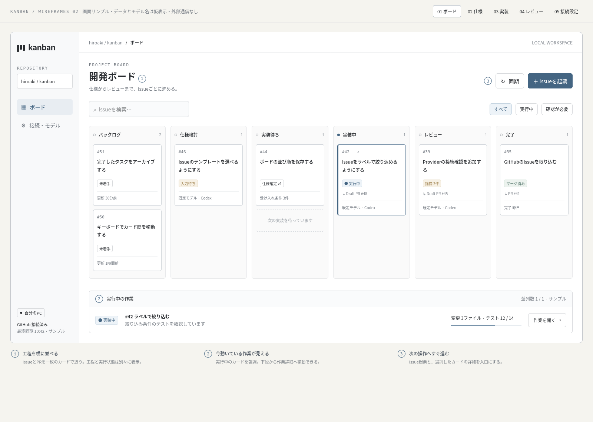
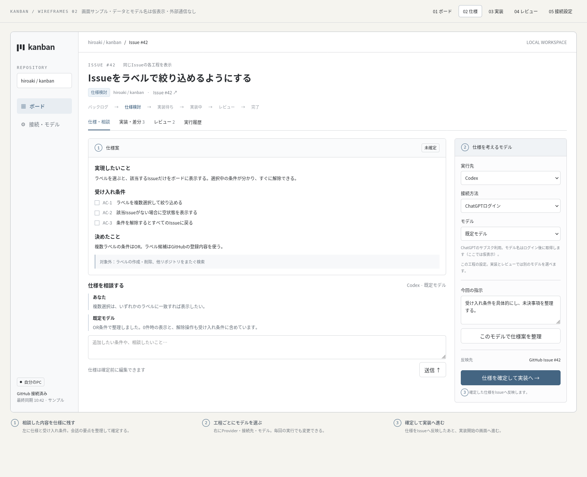
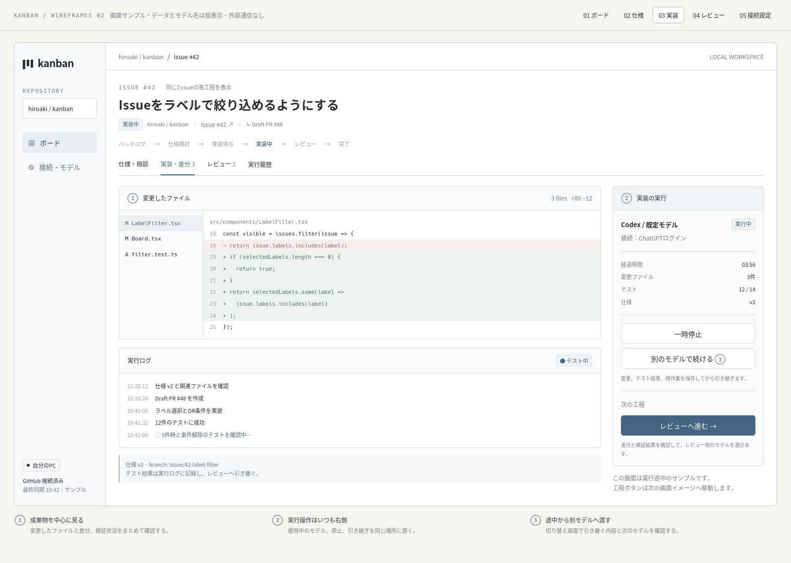
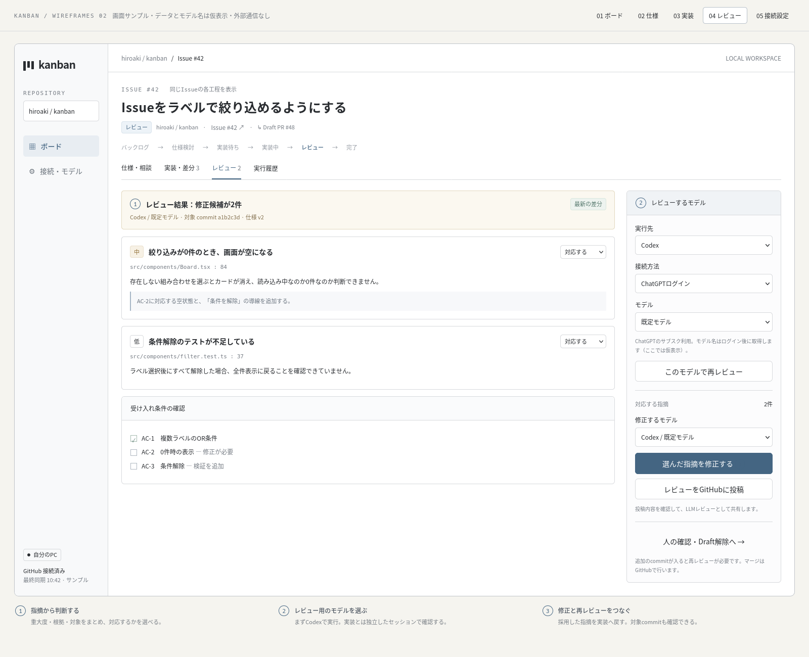
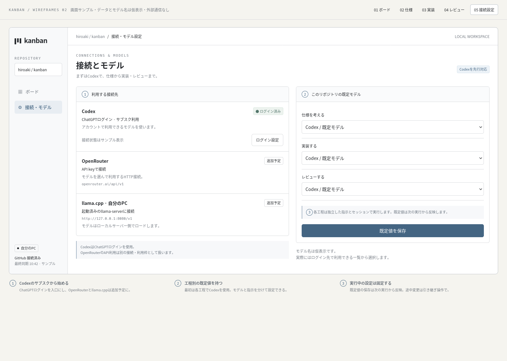
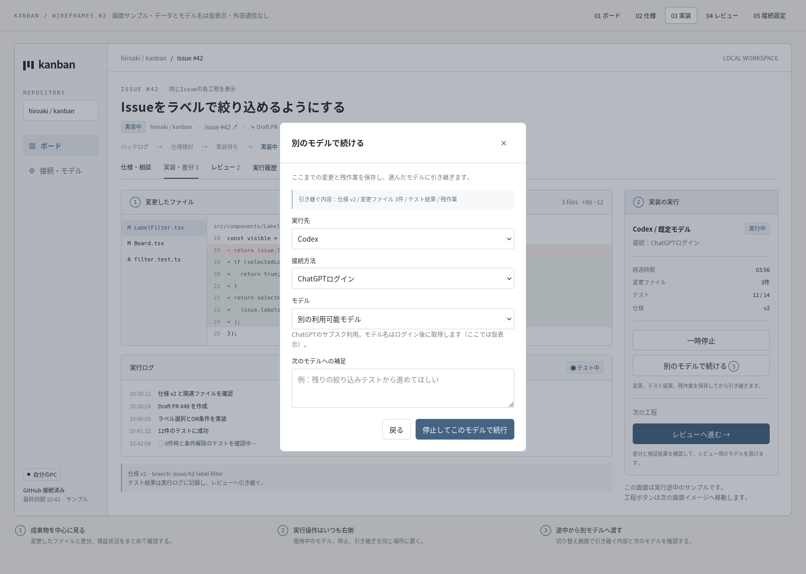
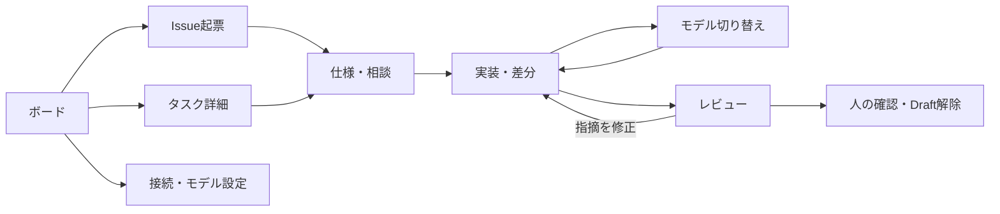

# Kanban 画面設計

- バージョン: 0.5
- 作成日: 2026-09-17
- 対応する仕様: [設計書 v0.8](design.md)
- 想定: 自分のPCのブラウザで使う、個人用のデスクトップ画面

## 画面イメージの見方

[操作できるワイヤーフレーム](wireframes/index.html)をブラウザで開くと、上部の「ボード / 仕様 / 実装 / レビュー / 接続設定」で画面を切り替えられる。HTMLファイル単体で開けるため、サーバーや依存パッケージの準備は不要。

画面内の数字は下部の説明と対応する。色や余白は配置を検討するための初期案とし、情報の優先順位と操作の流れを確認する。

Issue、PR、差分、実行結果、モデル名はすべてサンプル。GitHubやLLM APIへの通信は行わず、操作結果も永続化しない。仕様・実装・レビューの3画面は、同じIssue #42の異なる工程を表す。

初期版はCodexを使い、ChatGPTログインによるサブスク利用を優先する。OpenRouterとllama.cppは追加予定として表示する。エージェントの組み込みはPi coding-agentのRPC方式を推奨案とし、App Server方式との比較を設計書に残す。この画面案では共通する操作を示す。Piを採用する場合のWebログイン連携は別途検証する。

製品の画面はFastAPI + Jinja2 + HTMXで実装する案とする。カード・パネルはHTML断片、実行ログやLLM応答はSSEで更新し、ドラッグや差分表示には必要に応じてJavaScriptを併用する。現在のワイヤーフレームは配置と操作の確認用の単体HTMLであり、FastAPIやHTMXとの接続は未実装。

GitHub認証の追加実装: 接続設定の主操作は「GitHubに接続」とする。開始すると認証コードと「コードをコピーしてGitHubを開く」を表示し、別タブのGitHubで許可を受ける。アプリは2秒ごとにローカルの認証状態を確認し、完了後にアカウントと接続済み表示へ切り替える。認証待ちは画面の再読み込みでも維持し、キャンセル・期限切れ・失敗から再試行できる。[認証待ち画面（模擬データ）](screenshots/github-browser-login.png)

補助操作として「GitHub CLIの認証を使う」と「認証状態を再確認」を配置する。CLIの選択中アカウントと、アプリが使用するアカウントを表示する。ターミナルでの代替手順は「接続できないとき」、手動トークン登録は折りたたみ欄から選べる。エラー時も認証欄を残し、再試行・方式変更を可能にする。[接続後の画面（模擬データ）](screenshots/github-auth.png)

## 1. ボード

全体の進捗を見る入口。6列で工程を表し、カードにはIssue番号、タイトル、実行状態、PR、使用モデルを表示する。実行中のカードは枠を強調する。

- 右上に「Issueを起票」と「同期」。起票ではタイトルと背景を入力する。
- 上段の検索とフィルターで、作業中・確認待ちのタスクを探す。
- 下段には現在の実行を表示し、作業の詳細へ移動できるようにする。
- ドラッグによる工程変更は、このワイヤーフレームでは扱わない。

サンプルではIssue #42のカードと「作業を開く」から実装画面へ移動できる。他のカードは一覧の密度を確認するための表示例。

## 2. 仕様・相談

左に仕様案と相談、右にモデル選択と確定操作を置く。会話を読み返さなくても、実現する内容と受け入れ条件が分かる配置にする。

- 仕様案には実現したいこと、受け入れ条件、決定事項、対象外をまとめる。
- 相談の入力欄は仕様の下に置き、追加の条件を伝えられるようにする。
- 右側に実行先、接続方法、モデルを表示する。初期版はCodexとChatGPTログインを使い、利用できるモデルを選択する。
- 「仕様を確定して実装へ」でIssueへの反映と、次工程への遷移を示す。

ワイヤーフレームでは仕様案は固定表示。本文編集、LLM応答、GitHubへの反映は未実装で、相談の入力だけを画面に追加できる。

## 3. 実装・差分

中央には変更ファイル、差分、実行ログを置く。右側は現在使っているモデルと、停止・再開・切り替えの操作に固定する。

- 差分とテスト状況を同じ画面で確認する。
- 実行中のモデルは確定済みの値として表示する。
- 「一時停止」と「別のモデルで続ける」を分ける。
- 「レビューへ進む」で、レビュー用のモデルを選ぶ画面へ移動する。

画面例はテスト途中の状態。プロトタイプの「レビューへ進む」は画面遷移の確認用で、製品では設計書に定めたpushと検証結果の記録を条件にする。

## 4. レビュー

左に指摘と受け入れ条件の評価、右にレビュー用モデルと修正操作を置く。初期版ではレビューもCodexで行い、実装とは独立した指示とセッションを使う。レビュー用のモデルは実装用と別に選択できる。

- 指摘ごとに重大度、対象ファイル、問題の発生条件、修正案を示す。
- 「対応する / 採用しない / 保留」を選べる。
- 「選んだ指摘を修正する」で、修正用モデルを選んで実装に戻る。
- GitHubへの投稿、人による確認とDraft解除は別の操作にする。
- 対象commitと仕様の版を結果の近くに表示し、旧版のレビューとの区別に使う。

採用しない理由の入力や投稿内容の確認画面は、次の詳細化で追加する。

## 5. 接続・モデル設定

左に接続先、右に工程別の既定モデルを並べる。Codexを利用中の例とし、OpenRouterとllama.cppは追加予定として同じ画面に配置する。

- CodexではChatGPTログインとサブスク利用を表示する。ログイン状態はサンプルであり、実際のアカウントを確認したものではない。
- 「ログイン設定」から「ChatGPTでログイン」の案内を開ける。この操作も認証画面のサンプル表示までとする。
- OpenRouterはAPI key、llama.cppは起動済みのllama-serverへの接続を想定し、URLの例を表示する。
- 仕様・実装・レビューの既定モデルをそれぞれ設定する。
- 既定値は次回実行に反映し、実行中のモデル変更には引き継ぎ操作を使う。

Codexのモデル一覧はログイン後に取得する想定で、画面上の「既定モデル」「別の利用可能モデル」は仮の名前。サブスクの利用制限は確認できる情報に基づいて表示し、OpenRouterのAPI利用は別の利用枠として扱う。OpenRouterとllama.cppの接続編集フォームは、各接続先の追加時に詳細化する。

## 6. モデルの切り替え

実装画面の「別のモデルで続ける」でダイアログを開く。

1. 引き継ぐ仕様、変更ファイル、テスト結果、残作業を確認する。
2. 次の実行先とモデルを選択する。初期版の例はCodex内のモデル変更とし、OpenRouterとllama.cppは選択不可の「追加予定」として表示する。
3. 必要なら次のモデルへの補足を入力する。
4. 「停止してこのモデルで続行」で変更を保存し、新しい実行に引き継ぐ。

この操作はAPI接続先の変更だけでなく、進行中の作業を引き継ぐ操作として提示する。プロトタイプでは実装画面のモデル名と状態だけを更新する。

## 画面間の移動

上図は製品の遷移案。プロトタイプの起票操作は入力内容の確認メッセージまで、人の確認・Draft解除は操作の説明までを表示する。

## 次に詳細化する画面・状態

- 初回起動時のGitHub接続とリポジトリ選択。
- Codexのログイン待ち・失敗・期限切れ、サブスクの利用制限に達した状態。
- 仕様本文の編集、仕様確定後の変更と同期競合。
- Provider接続の追加・編集と、利用できないモデルの表示。
- 停止処理中、APIエラー、再起動後の復旧、旧版レビューの表示。
- GitHubへ反映する内容の確認と、指摘を採用しない理由の入力。

デスクトップでボードを俯瞰できる幅を基準とし、狭い画面では列を横スクロールする。タスク詳細は幅が狭い場合に本文と実行パネルを縦に並べる。
